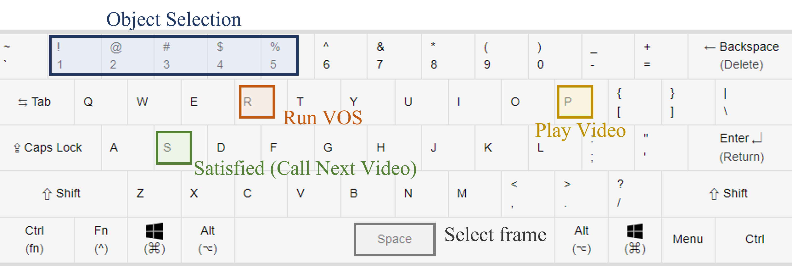

# GUI for IVOS(interactive VOS) and GIS (Guided IVOS)

GUI Implementation of 

CVPR2021 paper "Guided Interactive Video Object Segmentation Using Reliability-Based Attention Maps"

ECCV2020 paper "Interactive Video Object Segmentation Using Global and Local Transfer Modules"

Githubs:  
[CVPR2021](https://github.com/yuk6heo/GIS-RAmap) /
[ECCV2020](https://github.com/yuk6heo/IVOS-ATNet)

Project Pages:  
[CVPR2021](http://mcl.korea.ac.kr/yukheo_cvpr2021/) /
[ECCV2020](http://mcl.korea.ac.kr/yukheo_eccv2020/)

Codes in this github:

1. Real-world GUI evaluation on DAVIS2017 based on the [DAVIS framework](https://interactive.davischallenge.org/)
2. GUI for other videos

## Prerequisite
- cuda 11.0
- python 3.6
- pytorch 1.6.0
- [davisinteractive 1.0.4](https://github.com/albertomontesg/davis-interactive)
- numpy, cv2, PtQt5, and other general libraries of python3

## Directory Structure

 * `root/apps`: QWidget apps.

 * `root/checkpoints`: save our checkpoints (pth extensions) here.
 
 * `root/dataset_torch`: pytorch datasets.
 
 * `root/libs`: library of utility files.

 * `root/model_CVPR2021` : networks and GUI models for CVPR2021
     - detailed explanations on [[Github:CVPR2021]](https://github.com/yuk6heo/GIS-RAmap)
 * `root/model_ECCV2020` : networks and GUI models for ECCV2020
     - detailed explanations (including building correlation package) on [[Github:ECCV2020]](https://github.com/yuk6heo/IVOS-ATNet)
  
 * `root/eval_GIS_RS1.py` : DAVIS2017 evaluation based on the [DAVIS framework](https://interactive.davischallenge.org/).
 * `root/eval_GIS_RS4.py` : DAVIS2017 evaluation based on the [DAVIS framework](https://interactive.davischallenge.org/).
 * `root/eval_IVOS.py` : DAVIS2017 evaluation based on the [DAVIS framework](https://interactive.davischallenge.org/).
 * `root/IVOS_demo_customvideo.py` : GUI for custom videos
  
## Instruction

### To run
1. Edit `eval_GIS_RS1.py``eval_GIS_RS4.py``eval_IVOS.py``IVOS_demo_customvideo.py` to set the directory of your DAVIS2017 dataset and other configurations.
2. Download our parameters and place the file as `root/checkpoints/GIS-ckpt_standard.pth`.
    - For CVPR2021 evaluation [[Google-Drive]](https://drive.google.com/file/d/1dkgXJJ2gPYDtPE9yTtlP4Th0iNX5ZG6a/view?usp=sharing)
    - For ECCV2020 evaluation [[Google-Drive]](https://drive.google.com/file/d/1t1VO2zy3pLBXCWqme9h63Def86Y4ECIH/view?usp=sharing)
3. Run `eval_GIS_RS1.py``eval_GIS_RS4.py``eval_IVOS.py` for real-world GUI evaluation on DAVIS2017 or
4. Run `IVOS_demo_customvideo.py` to apply our method on the other videos

### To use


Left click for the target object and right click for the background.
1. Select any frame to interact by dragging the slidder under the main image
2. Give interaction
3. Run VOS
4. Find worst frame (if GIS, a candidate frame-RS1 or frames-RS4 are given) and reinteract.
5. Iterate until you get satisfied with VOS results.
6. By selecting satisfied button, your evaluation result (consumed time and frames) will be recorded on `root/results`.

## Reference

Please cite our paper if the implementations are useful in your work:
```
@Inproceedings{
Yuk2021GIS,
title={Guided Interactive Video Object Segmentation Using Reliability-Based Attention Maps},
author={Yuk Heo and Yeong Jun Koh and Chang-Su Kim},
booktitle={CVPR},
year={2021},
url={https://openaccess.thecvf.com/content/CVPR2021/papers/Heo_Guided_Interactive_Video_Object_Segmentation_Using_Reliability-Based_Attention_Maps_CVPR_2021_paper.pdf}
}
```

```
@Inproceedings{
Yuk2020IVOS,
title={Interactive Video Object Segmentation Using Global and Local Transfer Modules},
author={Yuk Heo and Yeong Jun Koh and Chang-Su Kim},
booktitle={ECCV},
year={2020},
url={https://openreview.net/forum?id=bo_lWt_aA}
}
```


Our real-world evaluation demo is based on the GUI of [IPNet](https://github.com/seoungwugoh/ivs-demo):
``` 
@Inproceedings{
Oh2019IVOS,
title={Fast User-Guided Video Object Segmentation by Interaction-and-Propagation Networks},
author={Seoung Wug Oh and Joon-Young Lee and Seon Joo Kim},
booktitle={CVPR},
year={2019},
url={https://openaccess.thecvf.com/content_ICCV_2019/papers/Oh_Video_Object_Segmentation_Using_Space-Time_Memory_Networks_ICCV_2019_paper.pdf}
}
```
